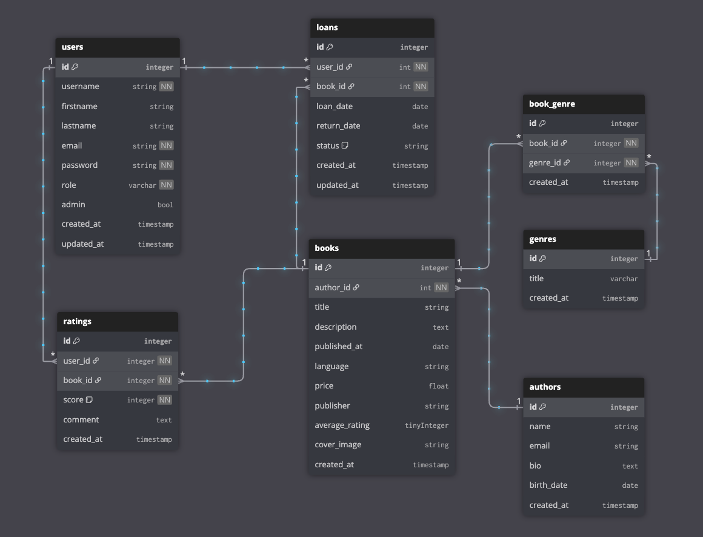

  

  📚 A modern Laravel 12 library application in a clean and scalable way.

  
  
  

---

## 📝 Description

I started this project to improve my Laravel skills. My goal is to explore all parts of the framework, touch on every aspect of Laravel, 
and become a better developer by learning from my mistakes along the way.

In this project I try to implement as many best practices as possible, focusing on clean code, separation of concerns, and maintainability. 
As a junior developer I still have a lot to learn, and this project is a great way for me to grow and challenge myself in a practical way.

---

## 🚀 Features

- REST API for managing books, authors and genres
- API authentication with Laravel Sanctum
- Role based access control (librarian, manager, admin)
- Modern and extendable architecture
- Feature, Unit and Architecture tests using Pest
---

## 🗺️ Database Design

Below is an overview of the current database schema:

